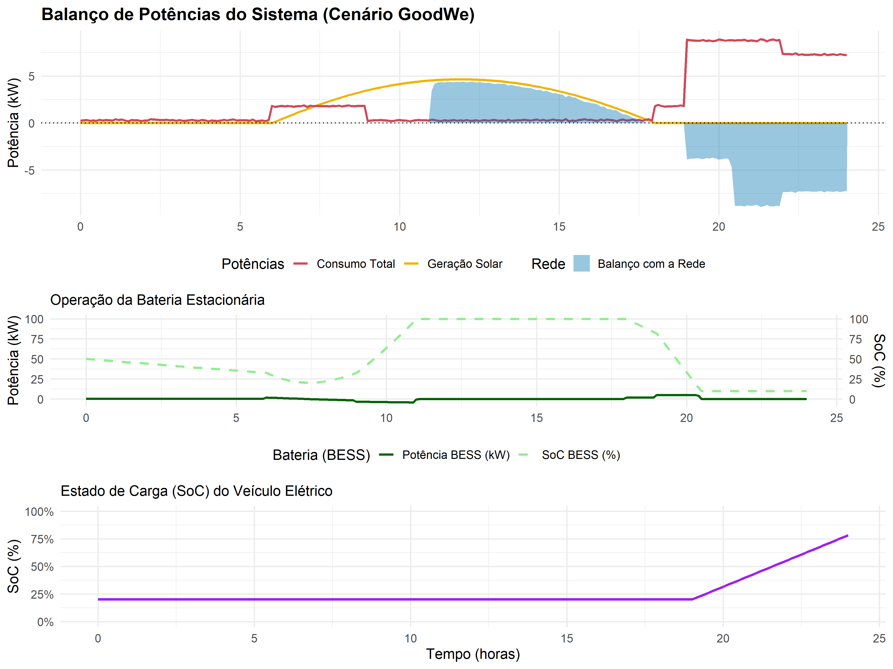

# Projeto de Modelagem Energética de Residência Inteligente

## Descrição do Projeto

Este repositório contém os artefactos do projeto de **Modelagem Matemática e Computacional** da FIAP. O objetivo foi simular o comportamento energético de uma residência inteligente equipada com um sistema solar fotovoltaico, um sistema de armazenamento por baterias (BESS) e um carregador para veículo elétrico (VE).

A simulação, desenvolvida em linguagem **R**, aplica conceitos de **Cálculo** (limites, derivadas e integrais) para analisar o fluxo de energia, identificar pontos críticos de consumo e geração, e avaliar a dinâmica do sistema ao longo de 24 horas. O cenário utiliza parâmetros baseados em equipamentos comerciais da **GoodWe** para garantir uma análise realista e alinhada com o mercado.

### Integrantes do Grupo

* João Pedro Tomas Dominguito
* Luiz Gustavo Lima da Silva
* Matheus Lara Carneiro
* Vicente Casellato Rodriguez

---

## Resultados da Simulação (Dashboard)

O dashboard abaixo resume visualmente os resultados da simulação de 24 horas, mostrando o balanço de potências, a operação da bateria estacionária e o estado de carga do veículo elétrico.

---

## Estrutura do Repositório

* `Relatorio_Final.pdf`: O relatório técnico completo do projeto, com a fundamentação teórica, a análise dos resultados e as conclusões.
* `codigo_final.R`: O código-fonte completo da simulação em R, utilizado para gerar todos os dados e gráficos.
* `dashboard_energetico.png`: A imagem do dashboard com os resultados visuais da simulação.

## Como Executar a Simulação

1.  Certifique-se de que tem o **R** e o **RStudio** instalados.
2.  Abra o ficheiro `codigo_final.R` no RStudio.
3.  O script irá verificar e instalar automaticamente todos os pacotes necessários (`ggplot2`, `gridExtra`, etc.).
4.  Execute o script completo (pode usar o atalho `Ctrl+Shift+Enter`).
5.  Ao final da execução, o script irá imprimir um relatório técnico no console e gerar o ficheiro `dashboard_energetico.png` atualizado no diretório.
